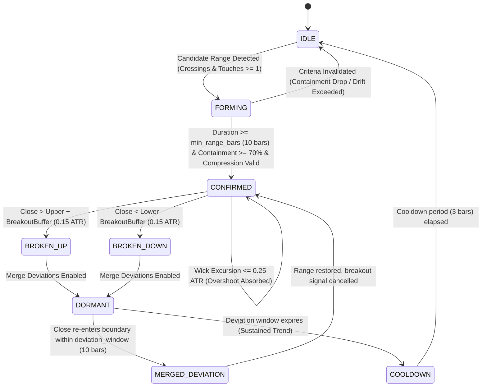

# NEXORA RANGE SCANNER — SYSTEM IMPLEMENTATION PLAN

**Project Name:** NEXORA RANGE SCANNER  
**Core Strategy:** Auto Range Detector [QuantAlgo] — Full Mathematical & State-Machine Reproduction  
**Target Market:** Binance USDⓈ-M Futures (Perpetual, USDT-Quoted)  
**Execution Modes:** PAPER (Default), TESTNET, LIVE (Strict confirmation required)  
**Attribution:** Creative Commons Attribution-NonCommercial-ShareAlike 4.0 International (CC BY-NC-SA 4.0) — Original indicator concept and design by QuantAlgo.

---

## 1. Executive Architecture Overview

NEXORA RANGE SCANNER is an institutional-grade, asynchronous quantitative trading system designed to scan the entire Binance USDⓈ-M Futures market, detect market-structure consolidation ranges using the exact Auto Range Detector [QuantAlgo] logic, and execute systematic breakout/breakdown signals with strict risk parameters.

### High-Level System Architecture

```mermaid
flowchart TD
    subgraph MarketDataLayer ["Market Data & Discovery"]
        ExchangeInfo[SymbolUniverseService] -->|Filter USDT Perp| ActiveSymbols[Active Symbol Universe]
        ActiveSymbols --> KlinePreloader[Historical Kline Preloader (1000-1500 bars)]
        ActiveSymbols --> WSManager[WebSocketManager (Multiplexed Streams)]
        WSManager --> CandleCache[CandleCache (Bar-Close Validation)]
        KlinePreloader --> CandleCache
    end

    subgraph StrategyLayer ["Core Strategy Engine"]
        CandleCache -->|Bar Close Event| IndicatorEngine[Auto Range Detector (QuantAlgo)]
        IndicatorEngine -->|Scale 1x/2x/3x| MultiScaleSelector[Multi-Scale Priority Selector]
        MultiScaleSelector --> RangeAnchor[Range Anchoring & Left Boundary]
        RangeAnchor --> StateMachine[Range Lifecycle State Machine]
        StateMachine -->|Confirmed Breakout| SignalEngine[Signal Engine & Duplicate Filter]
    end

    subgraph RiskLayer ["Risk & Sizing Engine"]
        SignalEngine --> RiskEngine[Risk Management Engine]
        RiskEngine -->|Check Daily Loss / Leverage / Exposure| SizingEngine[Risk-Based Position Sizer]
        SizingEngine --> StopProfitModel[SL & Multi-TP Model (1R, 2R, 3R)]
    end

    subgraph ExecutionLayer ["Execution Abstraction Layer"]
        StopProfitModel --> ExecutionRouter{Trading Mode Router}
        ExecutionRouter -->|MODE = PAPER| PaperAdapter[PaperExecutionAdapter]
        ExecutionRouter -->|MODE = TESTNET| TestnetAdapter[BinanceTestnetAdapter]
        ExecutionRouter -->|MODE = LIVE| LiveAdapter[BinanceLiveAdapter]
        PaperAdapter --> OrderLifecycle[Order & Position State Manager]
        TestnetAdapter --> OrderLifecycle
        LiveAdapter --> OrderLifecycle
    end

    subgraph PersistenceAndUI ["Persistence & Interfaces"]
        OrderLifecycle --> Database[(SQLite / PostgreSQL Schema)]
        StateMachine --> Database
        SignalEngine --> Database
        Database --> WebAPI[FastAPI REST & WebSocket Server]
        WebAPI --> WebDashboard[Modern High-Performance Web Dashboard]
        SignalEngine --> TelegramBot[Telegram Alert & Command Bot]
        TelegramBot -->|2FA Live Switch| LiveAdapter
    end
```

---

## 2. Directory & Module Structure

The project follows a clean architectural layout:

```
c:/NEXORA RANGE/
├── app/
│   ├── main.py                  # System bootstrapper, lifecycle management, FastAPI server
│   ├── config.py                # Pydantic v2 settings, .env loader, safety switches
│   └── dependencies.py          # Shared state, database session provider, service registry
│
├── core/
│   ├── models/                  # Pydantic schemas for domain objects
│   │   ├── candle.py            # OHLCV model with timestamp validation
│   │   ├── range.py             # Range structures, boundaries, metrics
│   │   ├── signal.py            # Trading signals, hashes, direction
│   │   ├── order.py             # Order requests, responses, fills
│   │   ├── position.py          # Active position tracking & PnL
│   │   └── account.py           # Balance, equity, margin tracking
│   ├── enums/                   # Enumerations (RangeState, OrderSide, TradingMode, etc.)
│   ├── events/                  # Async event definitions for pub-sub decoupling
│   └── exceptions/              # Domain-specific typed exceptions
│
├── exchange/
│   ├── binance/
│   │   ├── client.py            # Direct HTTP client for Binance USDⓈ-M Futures (httpx)
│   │   ├── filters.py           # LOT_SIZE, PRICE_FILTER, MIN_NOTIONAL precision handler
│   │   ├── market_data.py       # Universe discovery, kline fetching, data quality audits
│   │   ├── websocket.py         # WebSocketManager (multiplexing <=1024 streams, auto-reconnect)
│   │   ├── user_stream.py       # ListenKey keepalive & user data stream parsing
│   │   └── execution.py         # Real Binance Futures order placement & reconciliation
│   └── interfaces.py            # Abstract Base Classes for exchange adapters
│
├── strategy/
│   ├── range_detector.py        # QuantAlgo indicator math (Wilder ATR, Percentile, Drift, Rotation)
│   ├── range_state.py           # 8-state explicit state machine (IDLE -> FORMING -> CONFIRMED ...)
│   ├── signal_engine.py         # Breakout validation, timing enforcement, deduplication
│   └── parameters.py            # Indicator hyperparameters with strict defaults
│
├── risk/
│   ├── risk_engine.py           # Pre-trade safety audits (Daily Loss, Max Open Trades, Symbol Exposure)
│   ├── position_sizing.py       # Risk-of-ruin sizing: (equity * risk_pct) / stop_distance
│   └── exposure.py              # Portfolio-level margin and leverage accounting
│
├── execution/
│   ├── interface.py             # IExecutionAdapter interface definition
│   ├── paper.py                 # Full simulated exchange: slippage, maker/taker fees, SL/TP triggers
│   ├── testnet.py               # Binance Futures Testnet adapter (isolated keys/URL)
│   └── live.py                  # Real Binance Futures execution with pre-flight safety checks
│
├── backtest/
│   ├── engine.py                # Zero-lookahead event-driven backtester (candle-by-candle)
│   ├── metrics.py               # Institutional performance analytics (Sharpe, Sortino, Calmar, MaxDD)
│   ├── walk_forward.py          # In-sample / Out-of-sample / Walk-forward optimization engine
│   └── sensitivity.py           # Parameter sensitivity grid analysis
│
├── database/
│   ├── models.py                # SQLAlchemy ORM schemas
│   ├── repository.py            # Async CRUD repositories for candles, ranges, signals, orders, trades
│   └── database.py              # Engine creation, connection pooling, SQLite PRAGMA tuning
│
├── telegram/
│   ├── bot.py                   # Telegram Bot async worker with command router
│   └── messages.py              # Institutional signal formatting, alerts, MarkdownV2 templates
│
├── dashboard/
│   ├── static/                  # Vanilla CSS design system, dark mode, responsive styles
│   │   ├── css/
│   │   │   └── style.css        # Premium glassmorphism theme, CSS variables
│   │   └── js/
│   │       ├── app.js           # Real-time WebSocket connection to backend
│   │       └── chart.js         # Interactive TradingView Lightweight Charts integration
│   └── templates/
│       └── index.html           # Single-page dashboard: Scanner, Ranges, Positions, Backtest
│
├── tests/
│   ├── test_range_detector.py   # Mathematical verification against exact formula
│   ├── test_state_machine.py    # State transitions: FORMING -> CONFIRMED -> BREAKOUT -> DEVIATION
│   ├── test_paper_execution.py  # Sizing, fees, slippage, SL/TP execution
│   ├── test_risk_engine.py      # Circuit breakers, exposure limits, duplicate prevention
│   └── test_binance_filters.py  # Tick size, step size, min notional rounding
│
├── config.yaml                  # Unified human-readable configuration
├── .env.example                 # Environment variables blueprint
├── requirements.txt             # Python dependencies
└── README.md                    # Institutional documentation
```

---

## 3. Data Flow & Processing Lifecycle

1. **Discovery Phase:**
   - `SymbolUniverseService` queries `GET /fapi/v1/exchangeInfo`.
   - Filters for `status == "TRADING"`, `quoteAsset == "USDT"`, `contractType == "PERPETUAL"`.
   - Extracts and indexes precision filters (`pricePrecision`, `quantityPrecision`, `minQty`, `stepSize`, `tickSize`, `minNotional`).

2. **Ingestion & Caching:**
   - Preloads historical 1000-1500 closed klines via batched asynchronous REST requests.
   - Computes initial Wilder ATR(200) and baseline indicator calibration cache.
   - Establishes persistent WebSocket connection via `WebSocketManager` for multiplexed `<symbol>@kline_<timeframe>` streams.
   - Detects incomplete candles (`x == false`) vs candle close (`x == true`). All strategy evaluations trigger **exclusively on closed bars** (`x == true`).

3. **Range Detection Engine:**
   - When a candle closes, the OHLCV buffer is updated.
   - Evaluates multi-scale windows: `Base (20)`, `2x (40)`, `3x (60)`.
   - Computes percentile boundaries (90th/10th), compression ratio, percent rank across 500-bar lookback, horizontal drift slope, midline rotation crossings, boundary touches, and containment ratio.
   - If multiple scales qualify, **3x scale takes top priority**, followed by **2x**, then **Base**.
   - Anchors left boundary using backward containment expansion up to 300 bars if configured.

4. **State Machine Processing:**
   - Updates state: `IDLE` -> `FORMING` -> `CONFIRMED` -> `BROKEN_UP` / `BROKEN_DOWN` -> `DORMANT` -> `MERGED_DEVIATION` / `COOLDOWN`.
   - Absorbs overshoots within $0.25 \times \text{ATR}$ without triggering false breakouts.
   - Verifies breakout clearance beyond boundary $+ 0.15 \times \text{ATR}$.

5. **Risk & Order Routing:**
   - Confirmed breakout triggers `SignalEngine`. Generates a deterministic hash `signal_id`.
   - Duplicate filter ensures the same structural range never fires multiple orders.
   - `RiskEngine` validates portfolio exposure, daily loss thresholds, and active symbol count.
   - `PositionSizer` sizes the position based on the configured risk percentage and the distance to the structural stop loss.
   - Dispatches order to the active execution adapter (`PaperExecutionAdapter`, `BinanceTestnetAdapter`, or `BinanceLiveAdapter`).
   - Alerts sent to Telegram and broadcasted to Web Dashboard via WebSockets.

---

## 4. Range State Machine Formal Specification



---

## 5. Risk Management Architecture

1. **Risk per Trade:** Dynamic calculation:
   $$\text{Risk Amount} = \text{Account Equity} \times \text{Risk Per Trade \%}$$
   $$\text{Stop Distance} = |\text{Entry Price} - \text{Stop Loss Price}|$$
   $$\text{Raw Quantity} = \frac{\text{Risk Amount}}{\text{Stop Distance}}$$
   $$\text{Position Size} = \text{floor\_to\_step\_size}(\text{Raw Quantity}, \text{stepSize})$$
   $$\text{Verify Notional} = \text{Position Size} \times \text{Entry Price} \ge \text{minNotional}$$

2. **Structural Stop Loss Models:**
   - **Default:** Opposite Range Boundary $+ \text{buffer} \times \text{ATR}$
     - Long: `Range Lower - (0.10 * ATR)`
     - Short: `Range Upper + (0.10 * ATR)`
   - Midpoint Model: `(Range Upper + Range Lower) / 2`
   - ATR Distance Model: `Entry ± (multiplier * ATR)`

3. **Multi-Target Take Profit (1R, 2R, 3R):**
   - TP1: $1.0 \times \text{Risk Distance}$ (Partial close: 33% of position)
   - TP2: $2.0 \times \text{Risk Distance}$ (Partial close: 33% of position)
   - TP3: $3.0 \times \text{Risk Distance}$ (Final close: remainder)
   - Break-Even Trigger: Once TP1 is achieved, Stop Loss automatically adjusts to `Entry Price`.

4. **Circuit Breakers & Hard Stops:**
   - Max Daily Loss: $3.0\%$ of starting equity. If breached, all scanning and entries halt until UTC 00:00.
   - Max Open Positions: Default 5 concurrent positions.
   - Max Leverage: Default 5x (enforced on exchange account).
   - Cooldown after Consecutive Loss: 3 consecutive losses impose a 1-hour cooling period.

---

## 6. Database Schema (SQLite / PostgreSQL)

1. **`symbols`:** Symbol metadata, status, price/qty precision, min notional, tick size, step size, last updated.
2. **`candles`:** Historical and live closed klines (`symbol`, `timeframe`, `timestamp`, `open`, `high`, `low`, `close`, `volume`).
3. **`ranges`:** Detected range snapshots (`id`, `symbol`, `timeframe`, `scale_length`, `start_time`, `end_time`, `upper`, `lower`, `midline`, `width`, `containment`, `rotation_rate`, `drift`, `compression_rank`, `status`).
4. **`signals`:** Signal audit records (`signal_id`, `symbol`, `timeframe`, `direction`, `entry_price`, `stop_price`, `tp1`, `tp2`, `tp3`, `range_id`, `created_at`, `status`).
5. **`orders`:** Order tracking (`order_id`, `client_order_id`, `symbol`, `side`, `type`, `price`, `quantity`, `status`, `mode`, `created_at`).
6. **`positions`:** Portfolio state (`position_id`, `symbol`, `side`, `entry_price`, `quantity`, `leverage`, `unrealized_pnl`, `realized_pnl`, `status`, `mode`).
7. **`trades`:** Closed trade executions with full PnL, fee accounting, R-multiples, and duration.
8. **`account_snapshots`:** Periodic equity, balance, margin, and drawdown records.
9. **`risk_events`:** Audit trail for circuit breaker triggers, rejected orders, and limit breaches.
10. **`bot_events`:** System lifecycle events (startup, reconnects, shutdown, warnings).

---

## 7. Delivery Plan & Phases

- **Phase 1:** Core models, configuration, SQLite database, Binance client & symbol universe discovery.
- **Phase 2:** Market data engine, historical preloader, WebSocketManager multiplexer, candle cache.
- **Phase 3:** Exact Auto Range Detector indicator engine (Pine Script math reproduction).
- **Phase 4:** 8-state range state machine, overshoot absorption, deviation handling.
- **Phase 5:** Signal engine, multi-target TP/SL models, duplicate prevention.
- **Phase 6:** Event-driven backtester, walk-forward validator, sensitivity research engine.
- **Phase 7:** Paper execution engine with simulated orderbook, fees, slippage, and position tracking.
- **Phase 8:** Telegram alert bot with interactive status, safety controls, and live confirmation flow.
- **Phase 9:** Modern web dashboard (FastAPI, dark glassmorphism UI, real-time WebSocket, charts).
- **Phase 10:** Binance Testnet integration with isolated credentials.
- **Phase 11:** Binance Live execution adapter with strict pre-flight order validation and user data stream.
- **Phase 12:** Full test suite, Pine-vs-Python parity benchmarks, security verification, documentation.
